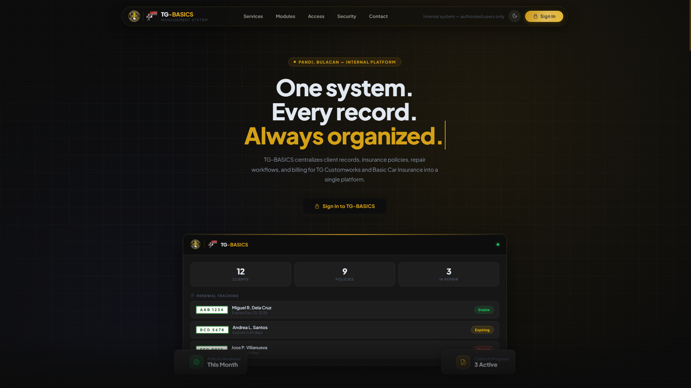

<div align="center">

<picture>
  <source media="(prefers-color-scheme: dark)" srcset="https://capsule-render.vercel.app/api?type=waving&color=0f0f0f&height=120&section=header&fontColor=fff"/>
  
</picture>

<h1>Tristan Reboredo</h1>

<p>
  Web Developer &nbsp;·&nbsp; BSIT Student &nbsp;·&nbsp; Sta. Maria, Bulacan
</p>

<p>
  <a href="mailto:tristhawnreboredo@gmail.com"></a>
  &nbsp;
  <a href="https://www.linkedin.com/in/tristan-reboredo-952305354/"></a>
  &nbsp;
  <a href="https://www.instagram.com/ethnrbrd_/"></a>
  &nbsp;
  
</p>

</div>

<br/>

I build web systems for small businesses — the kind that replace spreadsheets and paper logs with software that actually fits how the business runs. Currently studying at **STI College, Sta. Maria** and working with the Laravel ecosystem.

<br/>

## Stack

```
Backend   PHP · Laravel · MySQL
Frontend  Blade · Tailwind CSS · Alpine.js
Tools     Git · VS Code · Postman
```

<br/>

## Projects

### [TG-BASICS](https://github.com/trstnrbrd/TG_BASICS)
**Brokerage & Auto Shop Integrated Central System**

Unified management platform for a brokerage firm and auto shop — handling records, workflows, and reporting under one system.



<br/>

### [G-Track](https://github.com/trstnrbrd/G-Track) &nbsp; `in progress`
**GCash Transaction Management System**

Built for a sari-sari store owner to track GCash transactions, fees, and daily cash flow — turning scattered receipts into clear records.


<br/>

## GitHub

<div align="center">


&nbsp;&nbsp;


</div>

<br/>

<picture>
  
</picture>
