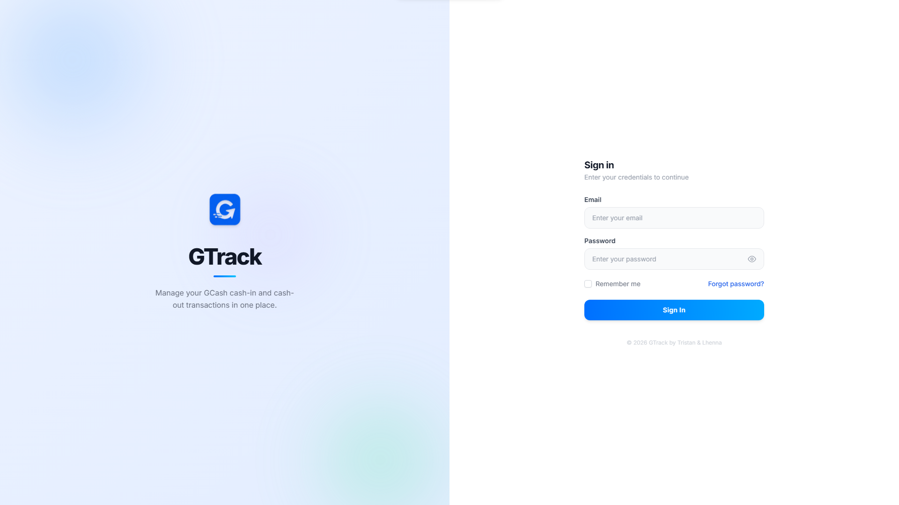

<div align="center">


[](https://git.io/typing-svg)

<p>
  <a href="mailto:tristhawnreboredo@gmail.com"></a>
  &nbsp;
  <a href="https://www.linkedin.com/in/tristan-reboredo-952305354/"></a>
  &nbsp;
  <a href="https://www.instagram.com/ethnrbrd_/"></a>
  &nbsp;
  
</p>

</div>

<br/>

I build web systems for small businesses — the kind that replace spreadsheets and paper logs with software that actually fits how the business runs. Currently studying at **STI College, Sta. Maria** and working with the Laravel ecosystem. Also getting into AI automation with **n8n**.

<br/>

## Stack


```
Backend   PHP · Laravel · MySQL
Frontend  Blade · Tailwind CSS · Alpine.js
Tools     Git · VS Code · Postman
```

<br/>

## Projects

### [TG-BASICS](https://github.com/trstnrbrd/TG_BASICS)
**Brokerage & Auto Shop Integrated Central System**

Unified management platform for a brokerage firm and auto shop — handling records, workflows, and reporting under one system.

<video src="assets/tg_landing.mp4" controls width="100%"></video>

<br/>

### [G-Track](https://github.com/trstnrbrd/G-Track) &nbsp; `in progress`
**GCash Transaction Management System**

Built for a sari-sari store owner to track GCash transactions, fees, and daily cash flow — turning scattered receipts into clear records.



<br/>

## GitHub

<div align="center">


&nbsp;


<br/>


</div>

<br/>


