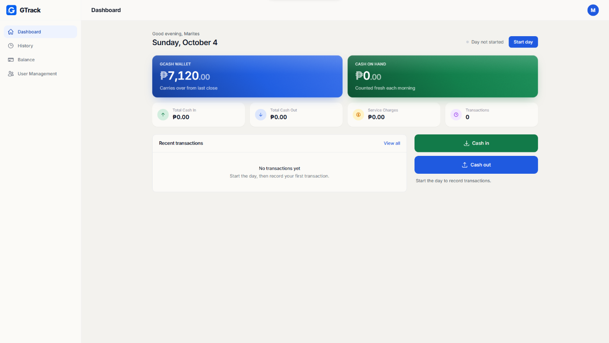

**Backend engineering student** · STI College, Sta. Maria

  
  
  
  

---

I’m a student who loves backend engineering—building reliable systems, APIs, and the data layers behind useful products.

## Tools & Stack

### Languages

  
  
  
  
  

### Backend & APIs

### Databases & Services

  
  
  
  

### Frontend

  
  
  

### AI Coding & Builders

  
  
  
  

### Automation

  

### Tools & Workflow

  
  
  
  
  

## Projects

<table>
  <tr>
    <td>
      <h3><a href="https://github.com/trstnrbrd/TG_BASICS">TG-BASICS</a></h3>
      
Brokerage and auto shop management system for records, workflows, and reporting.

      <video src="https://github.com/user-attachments/assets/bb29e890-6f1e-41dd-a53c-e4c948b07f34" controls width="100%"></video>
      

        
        
      

    </td>
  </tr>
</table>

<table>
  <tr>
    <td>
      <h3><a href="https://github.com/trstnrbrd/G-Track">G-Track</a> · In progress</h3>
      
GCash transaction tracker for a sari-sari store, organizing fees and daily cash flow.

      
      

        
        
      

    </td>
  </tr>
</table>

## GitHub

 

